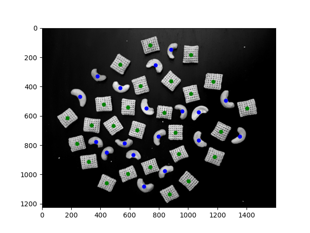
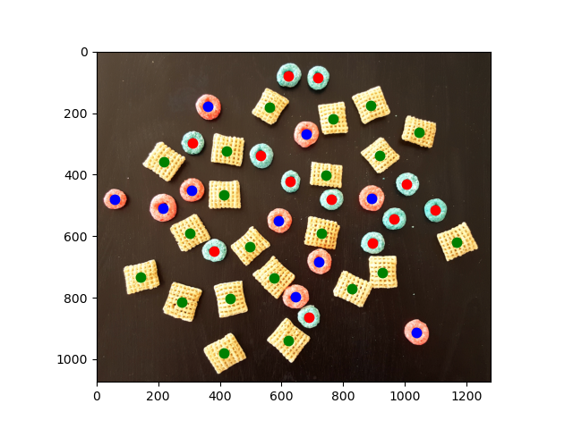
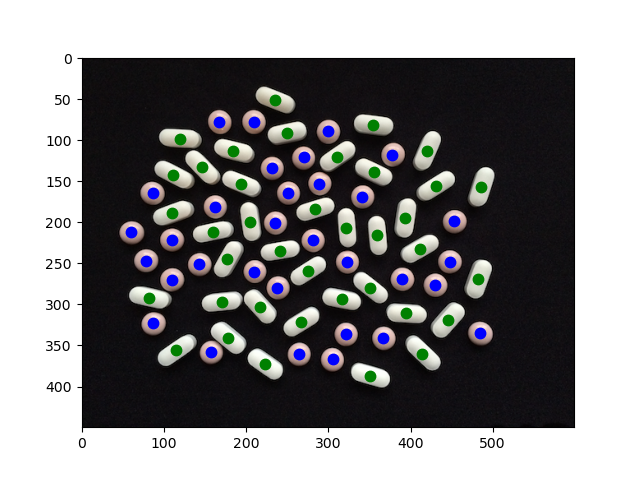

# Simple Object Detection and Classification

## Introduction

Object detection and classification are essential tasks in computer vision that involve identifying and categorizing objects within images. They aim to extract meaningful information from images.

This project delves into object detection and classification methodologies, exploring various techniques and algorithms to identify and categorize objects within images accurately. This project makes use of object features such as color and shape to determine and label them. The goal is to understand and implement effective approaches for detecting objects and classifying them based on predefined categories.

## Implementation
### Task 1

Task 1 performs object detection and classification on an image of cashews and Chex Mix. The work involves performing morphological operations on the image to separate each object and fill out the holes in the squares. 

A threshold is then chosen to separate the objects based on their shapes. 44 objects were found in total, of which 26 were squares and 18 were cashew nuts.

### Task 2

Task 2 performs object detection and classification on an image of Chex Mix, red donuts, and blue donuts. This program makes use of certain cv2 functions to fill out the holes in the donuts, then performs morphological operations to separate each object. The H channel of the image's HSV is used to get features, since this task involves color and well as shape.

We make use of the features perimeter and intensity to separate the images based on their sizes and colors. Two thresholds are chosen to separate the objects, and the followeing were found: 21 squares, 10 blue donuts, and 12 red donuts.

### Task 3

Task 3 is similar to Task 2 and aims to separate pills based on their shape and/or color. The following were found: 38 oval pills and 32 round pills.

## Conclusion

This project delved into object detection and classification, employing various techniques to accurately identify and categorize objects within images. Tasks 1, 2, and 3 showcased the application of morphological operations, color-based features, and shape analysis. The implementation successfully achieved the goal of detecting and classifying objects, demonstrating the versatility of computer vision in recognizing diverse objects based on their unique characteristics.
